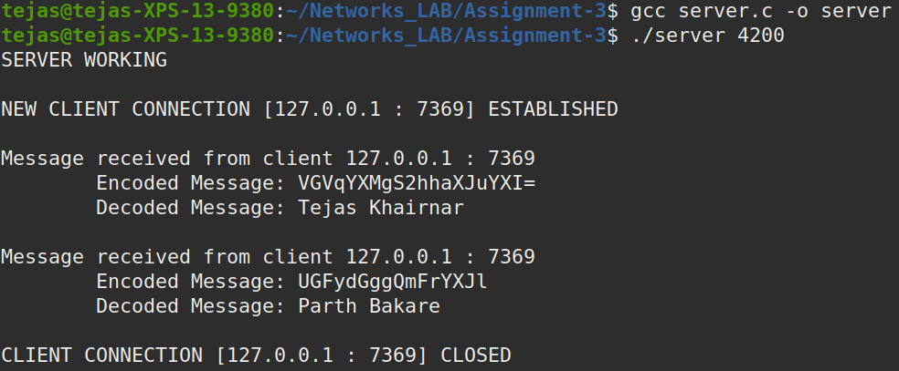
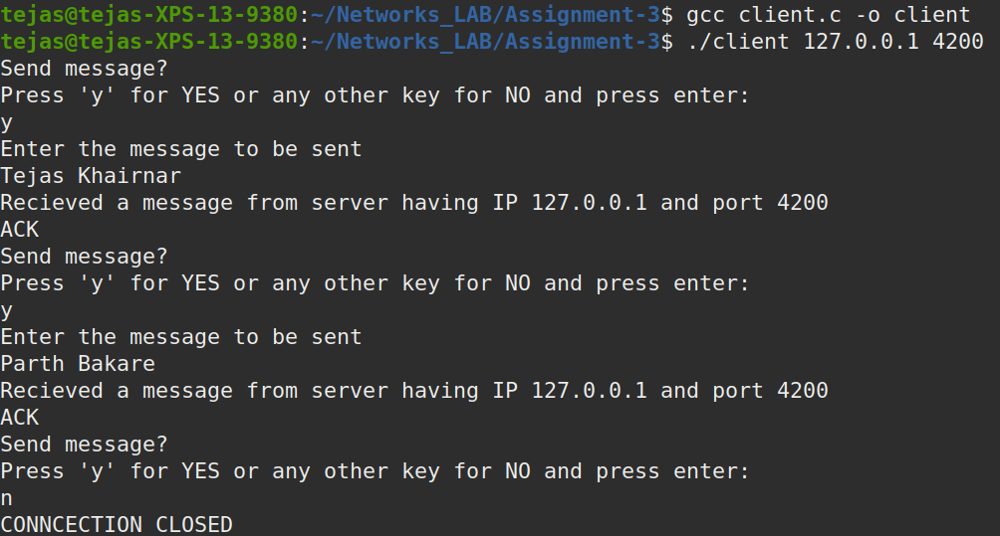

# <span style="color:red">Networks Lab - Assignment 3</span>

<span style="color: brown">
<b>Group 25:<br>
Tejas Khairnar: 180101081<br>
Parth Bakare:   180101056</b>
</span>

## <span style="color:blue">Compiling</span>

```
gcc server.c -o server    
gcc client.c -o client
```

## <span style="color:blue">Running</span>

### <span style="color:magenta">Starting the server:</span>
Execute the following command taking the server port number as argument
```
./server <port number> 
For example:  ./server 4200
```

### <span style="color:magenta">Starting the client:<span>
Execute the following command taking the server ip address and server port number as arguments.The server is bind to all available local interface ips. 
```
./client <server ip address> <server port number>
```

<span style="color:green">
<b>NOTE:</b> While running both server and client on a local machine use the IP of a loopback interface (127.0.0.1) found by using ifconfig command in the terminal and run the server and client in two different terminals 
</span>


## <span style="color:blue">Properties</span>

1. Server should run before client as client will connect to the server as soon as it runs.
2. Both client and server work on TCP sockets.
3. Server waits for TCP connection from client. 

## <span style="color:blue">Concurency Check</span>

Server starts a new child thread ( using fork() ) for every client so that multiple clients can be handled **concurrently**.

<div style="page-break-after: always;"></div>

## <span style="color:blue">Working of the client-server</span>

1. Once the client-server connection is setup, the client asks user to give input data which is then encoded using Base64 encoding where the maximum length os the message allowed is 1000 characters.
2. The client sends the encoded message to the server i.e the type 1 message.
3. After receiving the msg, server decodes the message and prints both encoded and decoded message and sends an "ACK" to the client i.e the type 2 message.  
4. **Note:** The "ACK" sent by the server is also encoded, and is decoded by the client.
5. Server and client remain in the loop to send any number of messages which the client wishes.
6. When user doesn't wish to send more messages he can press any key other than 'y' key on his keyboard, client sends a type 3 message to server and connections is closed.

## <span style="color:blue">Screenshots</span>


